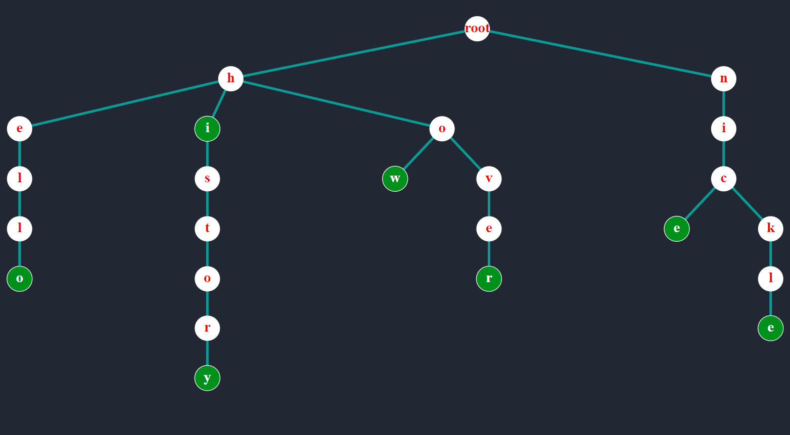
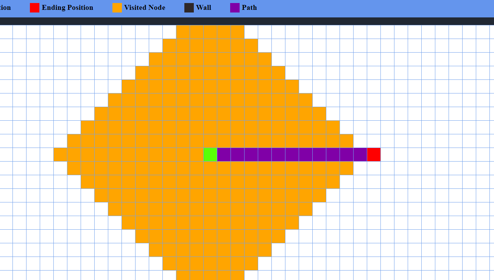

<!DOCTYPE html>
<html>
  <head>
    <title>Algorithm Visualizer</title>
    <link rel="stylesheet" href="css/styles.css" />
  </head>
  <body>
    

      

        <a href="/index.html">
Algorithm Visualizer
</a>
      

      

        

          <a href="algos/trie/index.html" class="category_link">
            

              
            

            
Trie

          </a>
        

        

          <a href="algos/bst/index.html" class="category_link">
            

              
            

            
Binary Search Tree

          </a>
        

        

          <a href="algos/path_finding/index.html" class="category_link">
            

              
            

            
Path Finding Visualizer

          </a>
        

        

          <a href="algos/sorting/index.html" class="category_link">
            

              
            

            
Sorting Visualizer

          </a>
        

      

    

  </body>
</html>
